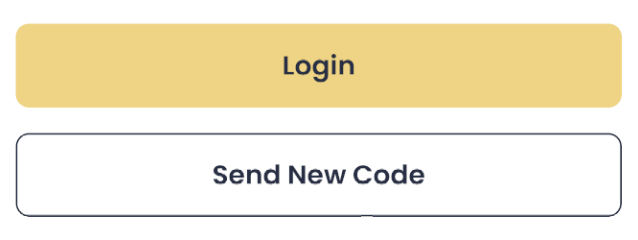

## Installation

Install medtec-ui with npm

```bash
  npm install medtec-ui
```
---
## MedButton Usage/Examples

```javascript
import { MedButton } from 'medtec-ui'

function App() {
  return  <Medutton
              text={"Login"}
              onPress={onPress}
              textColor={"black"}
              style={{ margin: 15 }}
              backgroundColor={"#EED484"}
          />
}
```


## Props


| Parameter | Type     | Description                       |
| :-------- | :------- | :-------------------------------- |
| `style`      | `object` | Style of button. |
| `onPress`      | `function` | Button click function. |
| `activeOpacity`      | `number` | Sets the view’s opacity when touched. Defaults to 0.6 |
| `disabled`      | `boolean` | If true, disable all interactions for this component. |
| `borderColor`      | `string` | Border color of button. |
| `borderWidth`      | `number` | Border width of button. |
| `backgroundColor`      | `string` | Background color of button. |
| `textColor`      | `string` | Text color of button. |
| `fontSize`      | `number` |  Font size of text. Defaults to 16. |
| `textOpacity`      | `number` | Opacity of text. |
| `fontFamily`      | `string` | Font family of text. |
| `textStyle`      | `object` | Style of text. |
| `text`      | `string` | Button text. |

## Screenshots


