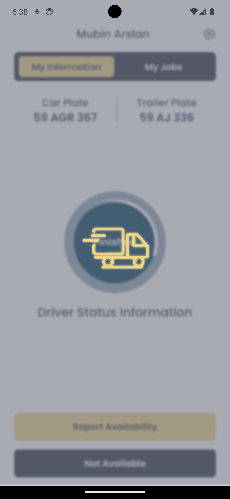
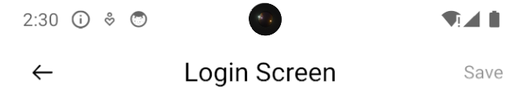

## Installation

Install medtec-ui with npm

```bash
  npm install medtec-ui
```

## Before Usage You Must Be Added To Package.json

```bash
    "@react-native-community/blur": "4.4.0",
    "lottie-react-native": "6.7.2",
    "react-native-linear-gradient": "2.8.3",
    "react-native-svg": "15.3.0",
    "react-native-svg-transformer": "1.4.0",
```
And add to metro.config.js
```javascript
const defaultConfig = getDefaultConfig(__dirname);
const { assetExts, sourceExts } = defaultConfig.resolver;

const config = {
    transformer: {
      babelTransformerPath: require.resolve("react-native-svg-transformer")
    },
    resolver: {
      assetExts: assetExts.filter((ext) => ext !== "svg"),
      sourceExts: [...sourceExts, "svg"]
    }
  };
```

---
## MedButton Usage/Examples

```javascript
import { MedButton } from 'medtec-ui'

function App() {
  return  <Medutton
            text={"Login"}
            onPress={onPress}
            textColor={"black"}
            style={{ margin: 15 }}
            backgroundColor={"#EED484"}
            />
}
```

## Props

| Parameter | Type     | Description                       |
| :-------- | :------- | :-------------------------------- |
| `style`      | `object` | Style of button. |
| `onPress`      | `function` | Button click function. |
| `activeOpacity`      | `number` | Sets the view’s opacity when touched. Defaults to 0.6 |
| `disabled`      | `boolean` | If true, disable all interactions for this component. |
| `borderColor`      | `string` | Border color of button. |
| `borderWidth`      | `number` | Border width of button. |
| `backgroundColor`      | `string` | Background color of button. |
| `textColor`      | `string` | Text color of button. |
| `fontSize`      | `number` |  Font size of text. Defaults to 16. |
| `textOpacity`      | `number` | Opacity of text. |
| `fontFamily`      | `string` | Font family of text. |
| `textStyle`      | `object` | Style of text. |
| `text`      | `string` | Button text. |

## Screenshots


---

## MedLoading Usage/Examples

```javascript
import { MedLoading } from 'med-ui'

function App() {
  return  <MedLoading
            blurType={"light"}
            reducedTransparencyFallbackColor={"white"}
            source={require('@assets/lottie/loadingYellow.json')}
            backgroundColor={`rgb(40, 47, 68)`}
            />
}
```

## Props

| Parameter | Type     | Description                       |
| :-------- | :------- | :-------------------------------- |
| `style`      | `object` | Style of loading view. |
| `source`      | `string` | The source of animation. "dark", "light" and "xlight" |
| `blurType`      | `string` | See blurType below. |
| `blurViewStyle`      | `object` | Style of blurView. |
| `lottieViewStyle`      | `object` | Border color of button. |
| `backgroundColor`      | `string` | Background color of view. |
| `lottieViewContainerStyle`      | `object` | Style of lottie's view. |
| `reducedTransparencyFallbackColor`      | `string` | It is used as a background color instead of blurring. IOS only.|

## Screenshots



---
## MedHeader Usage/Examples

```javascript
import { MedHeader } from 'med-ui'

function App() {
  return  <MedHeader
            rightButtonText={"Save"}
            title={"Language"}
            textColor={"white"}
            saveButtonOnPress={saveButtonOnPress}
            saveButtonActivity={isDisable}
        />
}
```

## Props

| Parameter | Type     | Description                       |
| :-------- | :------- | :-------------------------------- |
| `title`      | `string` | Center title. |
| `titleFontSize`      | `number` | Font size of title. Defaults to 20. |
| `isLoading`      | `boolean` | The loading state of the save button. |
| `rightIcon`      | `object` | The icon on the right side of the header.  |
| `rigthIconOnPress`      | `function` | Right icon press function. |
| `rigthIconOnActivity`      | `boolean` | Right icon press activity. |
| `rightButtonText`      | `string` | Right button text. |
| `rightButtonOnPress`      | `function` | Right button press function. |
| `rightButtonActivity`      | `boolean` | Right button press activity.|
| `rightButtonFontSize`      | `number` | Right button font size. Defaults to 14|
| `customGoBackEvent`      | `function` | Custom go back navigation activity.|
| `goBackActive`      | `boolean` | Screen allows to go back. Defaults to true|
| `customHeaderContainerStyle`      | `object` | Header container style. |
| `textFontFamily`      | `string` | Header text font family.|
| `textColor`      | `string` | Header text font color.|

## Screenshots




